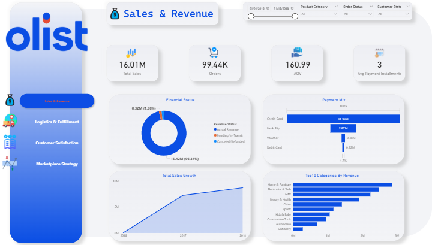
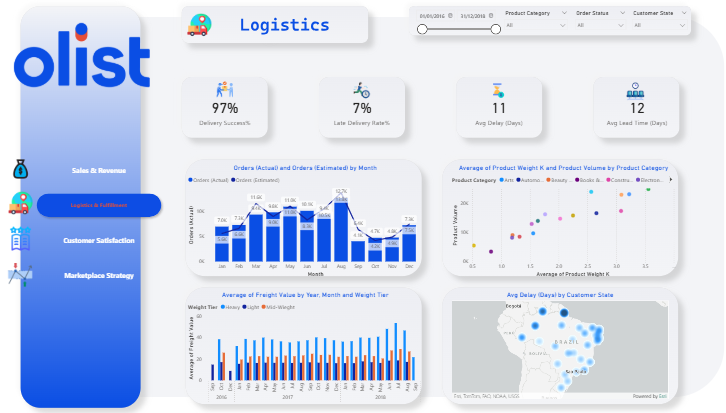
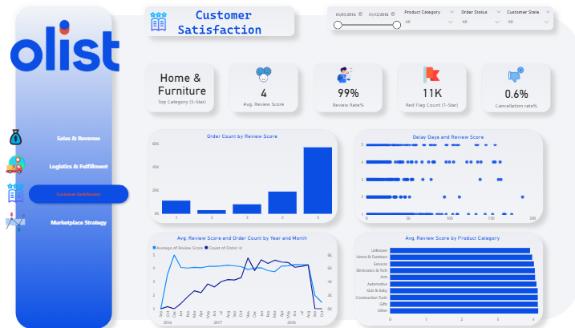
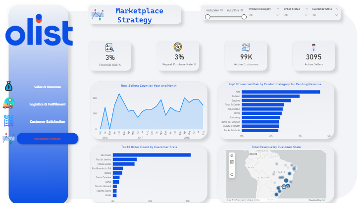

# Olist E-Commerce Analysis

End-to-End Business Intelligence & Data Analytics Project

# Overview

This project is an end-to-end Business Intelligence & Data Analytics project based on the Brazilian E-Commerce platform Olist.

The project analyzes:
- Customers
- Orders
- Products
- Payments
- Sellers
- Shipping
- Customer Reviews

The goal is to transform raw transactional data into actionable business insights and interactive dashboards.

---

# Business Problems

The project focuses on solving several marketplace challenges such as:
- Delivery delays
- High freight costs
- Financial risk from installment payments
- Customer dissatisfaction
- Operational inefficiencies

---

# Dataset

Olist Brazilian E-Commerce Dataset

The dataset contains:
- 100K+ Orders
- Customers
- Sellers
- Products
- Payments
- Reviews

---

# Project Workflow

1. Business Understanding
2. ERD & Database Design
3. Data Ingestion
4. SQL Database Implementation
5. Data Preparation
6. Power BI Data Modeling
7. Dashboard Development
8. Business Insights & Recommendations

---

# ERD

---

# Dashboard Preview

## Sales Dashboard

## Logistics Dashboard

## Customer Satisfaction Dashboard

## Marketplace Dashboard

# Key Business Insights

- Some states experienced high delivery delays due to geographical constraints.
- Home & Furniture products had the highest freight costs.
- Installment payments showed higher cancellation risk.
- Delivery delays negatively affected customer satisfaction.

---

# Tools & Technologies

- Python
- Pandas
- NumPy
- SQL Server
- Power BI
- DAX

---

# Project Outcome

The project successfully transformed raw marketplace data into interactive dashboards and actionable business insights that support business decision-making.
